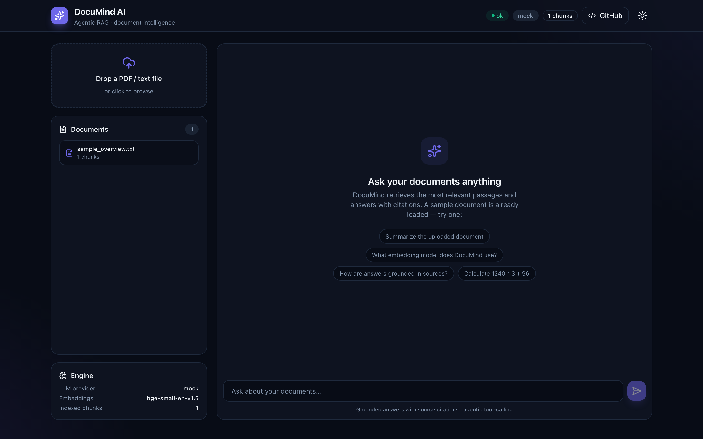
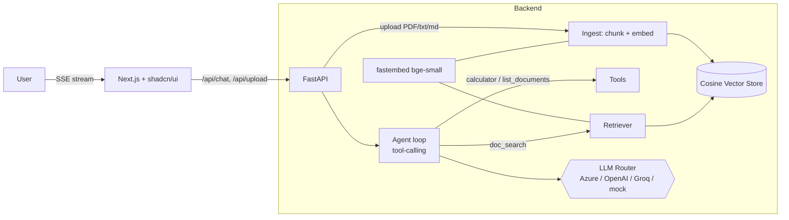

<div align="center">

# 🧠 DocuMind AI — Agentic RAG Document Intelligence

**Upload documents → ask questions → get grounded, cited answers from a tool-calling AI agent.**

Next.js · TypeScript · Tailwind · shadcn/ui &nbsp;|&nbsp; FastAPI · fastembed · Azure OpenAI / OpenAI / Groq



</div>

---

## ✨ Highlights

- **Agentic RAG** — an LLM agent that decides when to call tools (`doc_search`, `calculator`, `list_documents`), observes results, and synthesizes a grounded answer. Every response is **cited back to the source chunk**.
- **Any document, many at once** — upload **PDF, DOCX, PPTX, XLSX, CSV/TSV, HTML, JSON, Markdown, code and plain text** in a single drag-and-drop; each file is parsed, chunked, and indexed, and questions can span the whole corpus.
- **Real semantic retrieval** — documents are chunked (with overlap), embedded with **`bge-small`** via `fastembed` (ONNX, no PyTorch), and searched in a cosine vector index.
- **Provider-agnostic LLM** — swap between **Azure OpenAI**, **OpenAI**, or **Groq** with one env var. Ships with a **zero-key `mock` mode** so the whole app runs offline (and in CI).
- **Streaming UX** — Server-Sent Events stream the agent's **tool-call trace** and a **typewriter answer** to a polished Next.js + shadcn/ui interface (light/dark, drag-&-drop upload, source chips).
- **Evaluated** — a retrieval eval harness reports **hit-rate** and **MRR** over a seed question set.
- **Production-shaped** — typed API, unit + integration tests, Dockerfiles, `docker-compose`, and GitHub Actions CI.

## 🏗️ Architecture



**Agent loop:** `question → LLM picks tool → execute → observe → (repeat) → grounded answer + citations`.

## 🚀 Quickstart

### 1. Backend (FastAPI)
```bash
cd backend
python -m venv .venv && source .venv/bin/activate
pip install -r requirements.txt
cp .env.example .env            # LLM_PROVIDER=mock works with no keys
uvicorn app.main:app --reload   # → http://127.0.0.1:8000
```

### 2. Frontend (Next.js)
```bash
cd frontend
npm install
echo "NEXT_PUBLIC_API_BASE=http://127.0.0.1:8000" > .env.local
npm run dev                     # → http://localhost:3000
```

### 3. Or run everything with Docker
```bash
docker compose up --build       # frontend :3000, backend :8000
```

## 🔌 Using a real LLM

Set these in `backend/.env` (all optional — `mock` is the default):

| Provider | Env |
|---|---|
| **Azure OpenAI** | `LLM_PROVIDER=azure` · `AZURE_OPENAI_API_KEY` · `AZURE_OPENAI_ENDPOINT` · `AZURE_OPENAI_DEPLOYMENT` |
| **OpenAI** | `LLM_PROVIDER=openai` · `OPENAI_API_KEY` |
| **Google Gemini** | `LLM_PROVIDER=gemini` · `GEMINI_API_KEY` · `GEMINI_MODEL` |
| **Groq (free)** | `LLM_PROVIDER=groq` · `GROQ_API_KEY` |

## ☁️ Deploy

**Backend → Render** (Docker, free tier): push to GitHub, then *New → Blueprint* and select the repo — [`render.yaml`](render.yaml) provisions the API and health check. Set `LLM_PROVIDER` + the key for real answers.

**Frontend → Vercel**: *Import Project* → set **Root Directory = `frontend`** → add env var `NEXT_PUBLIC_API_BASE` = your Render API URL → Deploy.

## 🧪 Tests & evaluation
```bash
cd backend
pytest                 # unit + integration (offline, mock LLM)
python -m eval.evaluate   # → hit_rate@3 and MRR over a seed Q/A set
```

## 🗂️ Project structure
```
agentic-doc-assistant/
├── backend/
│   ├── app/
│   │   ├── rag/         # chunking, embeddings, vector store, pipeline
│   │   ├── agent/       # llm router, tools, agent loop
│   │   ├── eval/        # retrieval evaluation
│   │   └── main.py      # FastAPI (upload, chat SSE, documents, health)
│   └── tests/
├── frontend/            # Next.js 14 App Router, Tailwind, shadcn/ui
│   └── src/{app,components,lib}
├── docker-compose.yml
└── .github/workflows/ci.yml
```

## 🧰 Tech stack
**Backend:** Python, FastAPI, fastembed (bge-small), NumPy vector store, SSE, pytest.
**Frontend:** Next.js 14, TypeScript, Tailwind CSS, shadcn/ui, framer-motion, lucide-react.
**LLM/GenAI:** RAG, agentic tool-calling, prompt engineering, Azure OpenAI / OpenAI / Groq, retrieval evaluation.
**Ops:** Docker, docker-compose, GitHub Actions CI.

---

<div align="center"><sub>Built by <a href="https://github.com/Atulsah17">Atul Sah</a> · AI/ML Engineer</sub></div>
